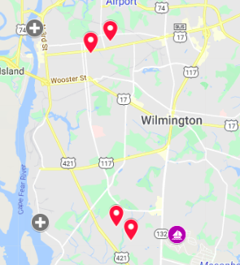
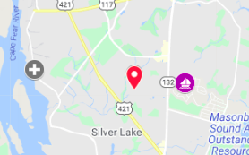
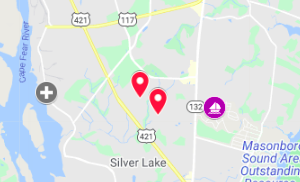
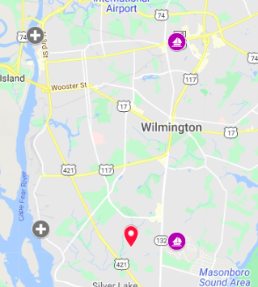
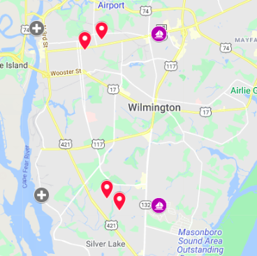
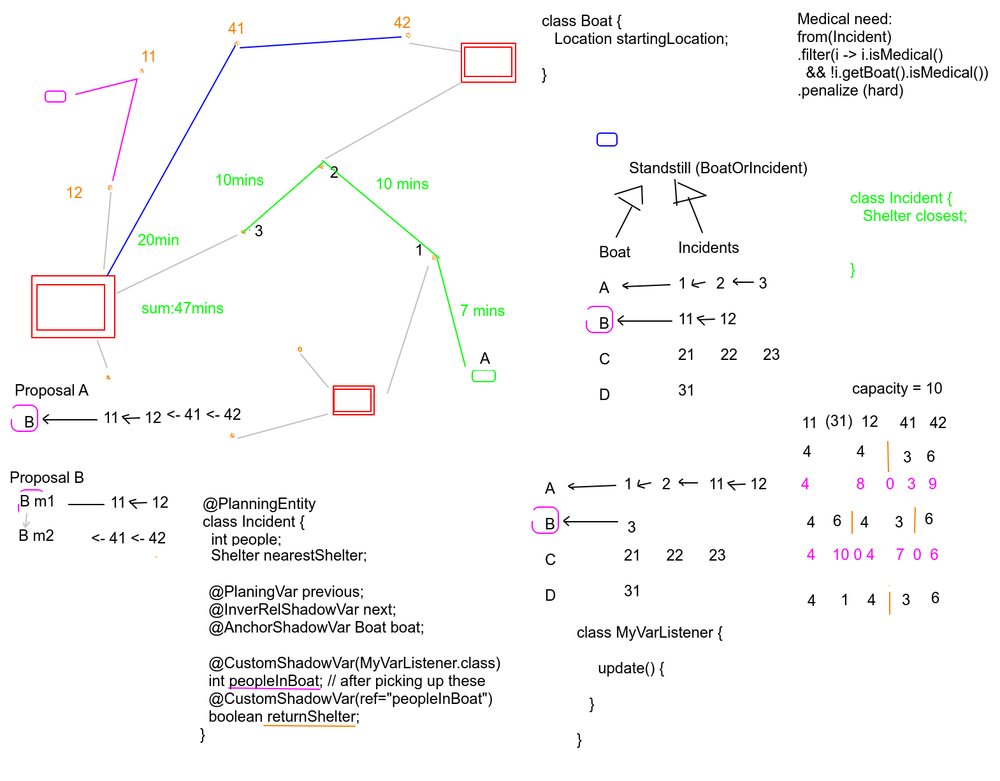

- [1. Overview](#1-overview)
  - [1.1. Background](#11-background)
  - [1.2. Purpose](#12-purpose)
  - [1.3. Dynamicity](#13-dynamicity)
  - [1.4. Detailed workflow](#14-detailed-workflow)
  - [1.5. Other potential extensions:](#15-other-potential-extensions)
- [2. Architecture](#2-architecture)
  - [2.1. Terminology](#21-terminology)
  - [2.2. Models](#22-models)
- [3. Impact Analysis](#3-impact-analysis)
- [4. Test Cases](#4-test-cases)
  - [4.1. Key](#41-key)
  - [4.2. Test Data](#42-test-data)
  - [4.3. Scenarios](#43-scenarios)
    - [4.3.1. Single Pickup, One Responder](#431-single-pickup-one-responder)
    - [4.3.2. Multi Pickup, One Responder,](#432-multi-pickup-one-responder)
    - [4.3.3. Single Pickup, Two Responders](#433-single-pickup-two-responders)
    - [4.3.4. Multi Pickup, Two Responders](#434-multi-pickup-two-responders)
    - [4.3.5. Multi Pickup, One Responder, Boat Capacity Exceeded](#435-multi-pickup-one-responder-boat-capacity-exceeded)
    - [4.3.6. Multi Pickup, Two Responders, One Medical](#436-multi-pickup-two-responders-one-medical)
- [5. Appendix](#5-appendix)
  
# 1. Overview

## 1.1. Background

Please see [section 1.3](https://www.erdemo.io/gettingstarted/#13-scenario) of the ER-Demo Getting Started Guide for a glossary of terms.

In the 2.x releases of the Emergency Response demo, *responders* are assigned to a single *incident* in a strict, deterministic manner using *technical rules*.  At runtime, these *technical rules* execute in the rules engine of Red Hat's Decision Manager product.

Because a responder can only pick up evacuees from a single incident at a time, utilization of the full boat capacity of a responder is typically less than optimal.

You can see a sample **incident response problem** in the diagram below. Red pins  represent incident locations, purple circles represent potential responder boats and grey circles represent shelter destinations (evacuation centers).

In the 2.x releases of the Emergency Response demo, a total of 4 missions would be executed in serial in the above scenario.  Each mission would assign the responder to a single incident at a time.

## 1.2. Purpose

The goal of this implementation is to create an ER-Demo mission consisting of an optimized set of incidents that maximizes responder boat capacity and other considerations such as distances to incidents  and medical attention requirements. 

## 1.3. Dynamicity

What makes this scenario more challenging than the more static VRP use case is it’s dynamicity. 

1. Incidents can (and will) continue to pop up during the demo.  
1. Responders can also be added to the scenario; in particular by demo participants logging in and registering.  
1. The availability of Responders varies; a Responder could be registered but they need to indicate they are available to be assigned a mission.  
1. Once on their way to rescue an Incident they will not be available to be assigned another one until they have pushed the “Picked Up” button in the Responder interface.  Similarly, once a Responder has accepted a mission to rescue an Incident and is on their way, that Incident will be removed from the pool (pinned).  

1. Priority Zone(s) can be created or deleted by the Incident Commander at any time during a demo run.  
1. There are multiple Shelters (as opposed to one Depot), the usual number is 3.  New Shelters can be created, but not typically during a particular run (that would be cool though.)
1. Once they have made their first rescue run, responders will be starting back out from the shelter where they made their first dropoff.

This implementation resolves a variety of different use-cases as depicted in section 4 of this document.

## 1.4. Detailed workflow

1. Incidents are simulated (as they are now).  They are created using the simulator engine and there could be 10s, 100s, or 1000s of them.  Additional Incidents can be created at any time.

1. A participant Responder registers as they do now, indicating name, phone, boat capacity, medical capability.  Responders can also be created by the simulator engine (and typically are).

1. Participant Responders indicate their location on the map, then press “Available”.  A mission is created.

1. As Incidents and Responders enter the system the OptaPlanner engine continually refines a candidate solution.

1. The OptaPlanner-as-a-Service engine is queried to present the current mission solution for a Responder.  They are only given the first incident to rescue, and the route to them.

1. Once the Responder arrives at the Incident location they press “Picked Up” in the Responder interface (this is done automatically for the simulated Responders).

1. Because the Incident has been picked-up, the Incident icon should disappear on the map.

1. Again the engine is queried to provide the next incident to proceed to, along with the route.

1. These steps continue until the next step is “proceed to this shelter”, when their capacity is full.  They do so, unload all evacuees, and then press “Available” to be sent out again.

1. Responders continue to be assigned Incidents until all have been rescued or assigned.

## 1.5. Other potential extensions:

1. Allow for the number of people picked up to differ from the number requested/stored (they miscounted, or got rescued by someone not in the system).

1. Incidents being cancelled.

1. Incidents being created outside of the simulator (e.g., the project in the works for injecting participant-created incidents using ML/NLP.)

1. Responders cancelling.

1. Responders deciding to abandon the plan and head straight to a shelter (perhaps because of a life-or-death medical need)

  (To be clear, we are not implementing any of these now.)

# 2. Architecture

https://en.wikipedia.org/wiki/Vehicle_routing_problem
    Vehicle Routing Problem with Pickup and Delivery

## 2.1. Terminology
For general overview of Optaplanner terminology and concepts, please see the [Optaplanner docs](https://docs.optaplanner.org/7.44.0.Final/optaplanner-docs/html_single/index.html).

The following are Optaplanner concepts used specifically in the Emergency Response demo application:

* **chained model:**
  The ER-Demo responder boat is the chain's anchor and the chain is a series of incident locations.
  Any chain that contains a *priority zone* and the *priority zone* is not the boat's first stop should be penalized.

* **Standstill:**
  [Standstill.java](https://github.com/kiegroup/optaweb-vehicle-routing/blob/master/optaweb-vehicle-routing-backend/src/main/java/org/optaweb/vehiclerouting/plugin/planner/domain/Standstill.java) is the PlanningEntity in the *optaweb-vehicle-routing* reference demo.  It raises a lot of confusion.  It represents a common property of vehicle/boat (chain anchor) and visits/customers/rescue points (chain items).  The common property is that both anchor and regular chain item can be the **previous** item.  Each visit/incident has to have a *previousSomething*.  That something can be either a visit or a vehicle/boat anchor.  Standstill covers both cases.  If Java had union types there would be no need for Standstill.

* **Shadow Variables:**
  Shadow variables are closely related to the chained model. They bridge the gap between how the domain model is used by OptaPlanner and how the programmer wants to use it. OptaPlanner uses Visit's previousStandstill field as the planning variable and assigns another Visit or a Vehicle to it. So it starts with a single element and builds the chain by adding more elements to it until it adds the anchor (which itself doesn't have a planning variable so it terminates the chain). The important thing to notice is that this way the chain is built in the opposite direction than the vehicle (anchor) goes through the visits. But as a programmer, when you work with the solution, when you visualize or analyze it, you start with a vehicle and go over its visits in order that is opposite to how the chain is represented. @InverseRelationShadowVariable makes this possible without you having to do any extra work. Another shadow variable is the @AnchorShadowVariable that holds the anchor of the chain for each element in the chain, again, with no extra effort from the programmer. This variable makes it easier to write the capacity constraint.

## 2.2. Models
[Planner Model](https://lucid.app/lucidchart/eb96d556-7843-4784-81d6-4fac81235fb9/edit?page=.sCE-U~NQ8yl#)

# 3. Impact Analysis
# 4. Test Cases

## 4.1. Key
* [Map](https://www.google.com/maps/d/u/0/edit?hl=en&mid=1jHqK76mb6NUcxlomcNLDoVm9zXeu-ayB&ll=34.18821162394133%2C-77.9599111328125&z=12)

* **Shelters:**
  *    Port City Marina            :   34.2461, -77.95189
  *    Wilmington Marine Center    :   34.1706, -77.949
  *    Carolina Beach Yacht Club   :   34.0583, -77.88849

* **Responders:**
  *  Leonardo Echevarria         :    34.24352, -77.88472
  *  Jose Hernandez              :    34.16616, -77.88472

* **Incidents:**
  *  Stacy Jefferson             :   34.24068  -77.91596
  *  Jessica Adams               :   34.23614  -77.92523
  *  Jacob Barber                :   34.16906  -77.91329
  *  Reagan Wilson               :   34.16343  -77.90648

## 4.2. Test Data

[Test Data Directory](../src/test/resources/scenario1)

## 4.3. Scenarios

### 4.3.1. Single Pickup, One Responder

* **Scenario:**

  1 incident with 5 evacuees and no medical required

  1 responder with boat capacity of 10 and no first aid kit

  

* **Expectations:**
  J. Hernandez picks-up and transports R. Wilson to Wilmington Marine Center

### 4.3.2. Multi Pickup, One Responder, 
* **Scenario:**

  2 incidents with 8 evacuees total and no medical required
  
  1 responder with boat capacity of 10 and no first aid kit
  
  
  
* **Expectations:**
  J. Hernandez picks-up evacuees of both incidents and transports to Wilmington Marine Center
  
### 4.3.3. Single Pickup, Two Responders
* **Scenario:**

    
    
* **Expectations:**
  J. Hernandez picks-up evacuees of single incident and transports to Wilmington Marine Center
  
### 4.3.4. Multi Pickup, Two Responders
* **Scenario:**

  
  
* **Expectations:**
  Each responder closest to set of incidents picksup corresponding evacuees and transports to closest Evacuation Center
  
### 4.3.5. Multi Pickup, One Responder, Boat Capacity Exceeded
* **Scenario:**

  
  
* **Expectations:**
  J. Hernandez picks-up evacuees closest to him and then either drops off at Wilmington Marine Center or picks up Jessica Adams and drops off at Port City Marina
  
### 4.3.6. Multi Pickup, Two Responders, One Medical
* **Scenario:**

    
    
* **Expectations:**
  Jose Hernandez picks up J. Adams, Stacy Jefferson & J. Barber
  Leonardo Echevarria picks up Reagan Wilson

# 5. Appendix

  
